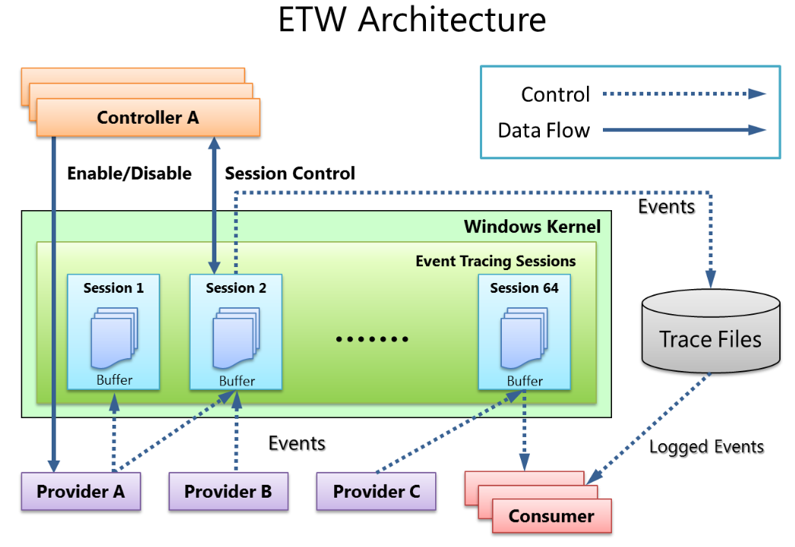
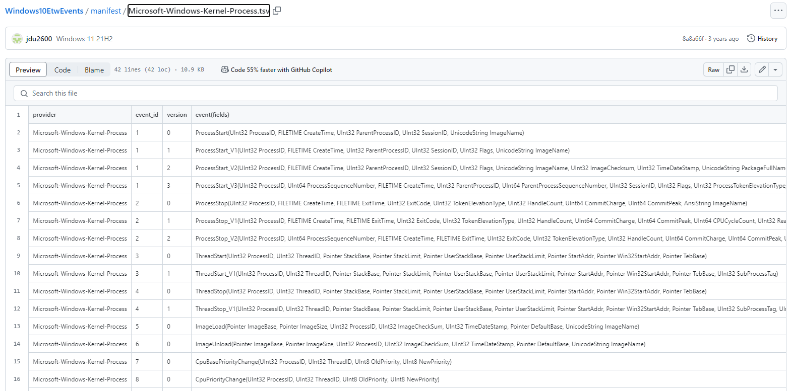
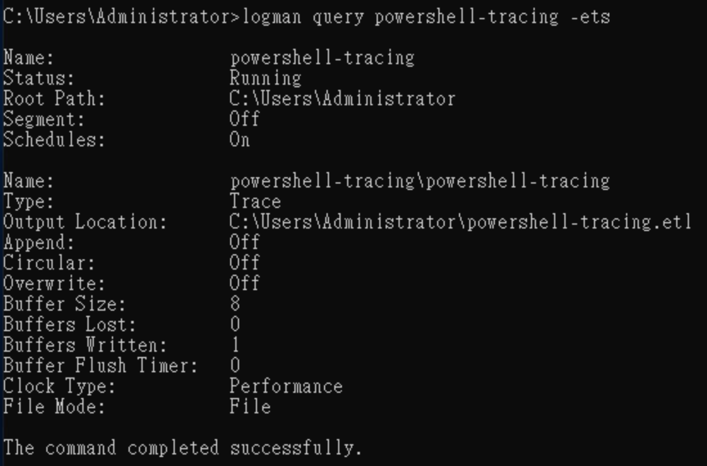
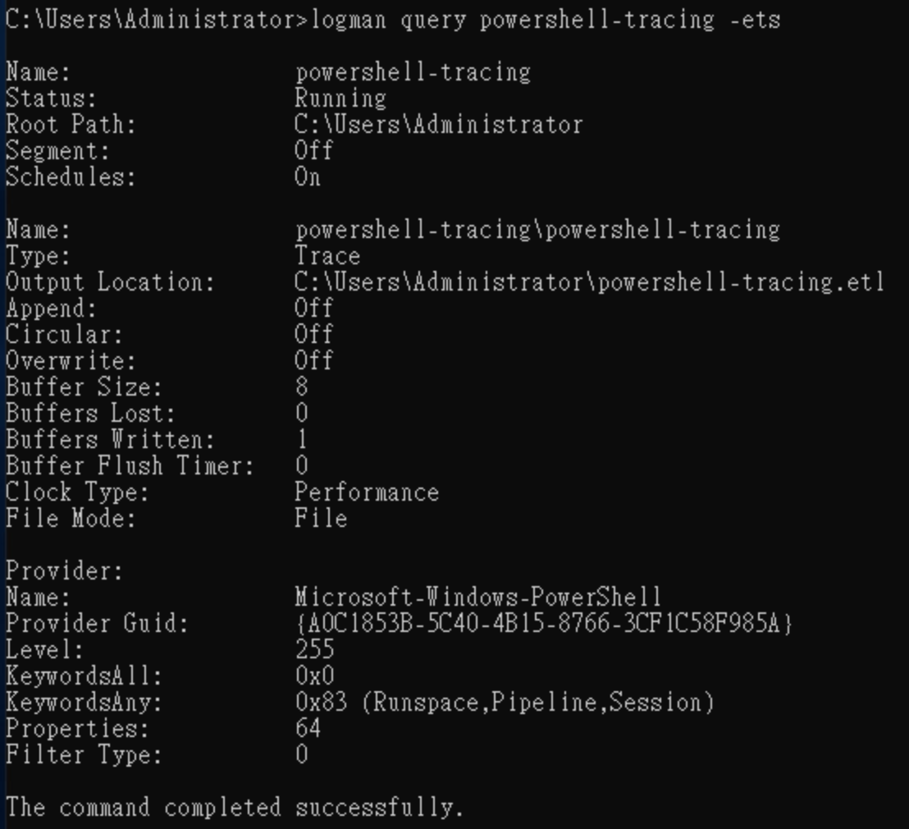

# ETW

Event Tracing for Windows (ETW) provides a mechanism to trace and log events that are raised by user-mode applications and kernel-mode drivers.



The components of ETW include Controller, Provider, Consumer, and Session :

- Controller: Controls the enabling/disabling of Providers, creates Sessions, and sets which Providers are responsible.
- Provider: Generates events and sends them to Sessions.
- Consumer: Views and utilizes data from Sessions.
- Session: Records events from one or more Providers and manages/clears buffer data.

### **Windows10EtwEvents**

One Provider may offer multiple events, each identified by a specific Event ID.

Therefore, there are online resources that compile information about various Providers and their corresponding event IDs. For details, please refer to [Windows10EtwEvents](https://github.com/jdu2600/Windows10EtwEvents/tree/main).

Example : 

Check Microsoft-Windows-Kernel-Process event



---

### Using ETW:

Windows includes a built-in tool called Logman, which can be used to view information about Providers and the status of Sessions.

Example :

- `logman query providers` allows you to see all configured Providers on the system


- Viewing a specific Provider
    
    
    
- `logman create trace powershell-tracing -ets` Creating a session
    
    
    
- `logman update powershell-tracing -p Microsoft-Windows-PowerShell 0x83 -ets`
    
    This command allows you to specify a Provider and choose the events provided by the Provider.
    
    - `-p`  choose Provider
    - `0x83` subscribes to events from `Microsoft-Windows-PowerShell`
        - 0x0000000000000001  Runspace
        - 0x0000000000000002  Pipeline
        - 0x0000000000000080  Session
        - 0x01 + 0x02 + 0x80 = 0x83
            
            
            
- You can see `powershell-tracing.etl` from the Event Viewer.
    
    
    

---

### krabsetw

krabsetw is a C++ library that simplifies interaction with ETW. For details, please refer to [krabsetw](https://github.com/microsoft/krabsetw).

The following uses the krabsetw library to monitor process start events in the Windows system.

```cpp
#include <krabs.hpp>
#include <iostream>

void start_etw_trace()
{
    krabs::user_trace trace;

    krabs::provider<> provider(L"Microsoft-Windows-Kernel-Process"); //choose Provider
    provider.any(0x10);  // choose event WINEVENT_KEYWORD_PROCESS

    auto process_callback = [](const EVENT_RECORD& record, const krabs::trace_context& trace_context) {
        krabs::schema schema(record, trace_context.schema_locator); // Definition of file structure
        krabs::parser parser(schema); // Used for parsing and extracting specific property values from event logs.
        uint32_t ppid = parser.parse<uint32_t>(L"ParentProcessID");
        uint32_t pid = parser.parse<uint32_t>(L"ProcessID");
        std::wstring image_name = parser.parse<std::wstring>(L"ImageName");
 
        std::wcout << L"[>] Process Name: " << image_name << std::endl;
        std::wcout << L"[>] ParentProcess ID: " << ppid << std::endl;
        std::wcout << L"[>] ProcessID " << pid << std::endl;
        std::wcout << std::endl;
        };

    // real-time process start events
    krabs::event_filter process_filter(krabs::predicates::id_is(1)); // Only capture events with ID 1.
    process_filter.add_on_event_callback(process_callback); // When the filter captures an event, it will be passed to a callback for processing.
    provider.add_filter(process_filter); // Add the filter to the provider.

    trace.enable(provider); // Set up to use the specified Provider.
    trace.start(); // Event tracing will officially start.
}

int main()
{
    std::cout << "[+] Monitoring Starting!\n" << std::endl;
    start_etw_trace();
}
```

<aside>
👇 Note : The executable needs to be run with administrator privileges to function properly.

</aside>


---

### ETWProcessMon2

ETWProcessMon2 is for Monitoring Process/Thread/Memory/Imageloads/TCPIP via ETW + Detection for Remote-Thread-Injection & Payload Detection by VirtualMemAlloc Events (in-memory) etc. For details, please refer to [ETWProcessMon2](https://github.com/DamonMohammadbagher/ETWProcessMon2?tab=readme-ov-file) .

### **Tools**

- [https://github.com/jdu2600/Windows10EtwEvents](https://github.com/jdu2600/Windows10EtwEvents)
- [https://learn.microsoft.com/zh-tw/windows-server/administration/windows-commands/logman](https://learn.microsoft.com/zh-tw/windows-server/administration/windows-commands/logman)
- [https://github.com/DamonMohammadbagher/ETWProcessMon2?tab=readme-ov-file](https://github.com/DamonMohammadbagher/ETWProcessMon2?tab=readme-ov-file)

### **Resource**

- [https://www.ired.team/miscellaneous-reversing-forensics/windows-kernel-internals/etw-event-tracing-for-windows-101](https://www.ired.team/miscellaneous-reversing-forensics/windows-kernel-internals/etw-event-tracing-for-windows-101)
- [https://github.com/microsoft/krabsetw](https://github.com/microsoft/krabsetw)
- [https://blog.securehat.co.uk/detection-experiments/detecting-parent-process-spoofing-using-krabsetw](https://blog.securehat.co.uk/detection-experiments/detecting-parent-process-spoofing-using-krabsetw)
