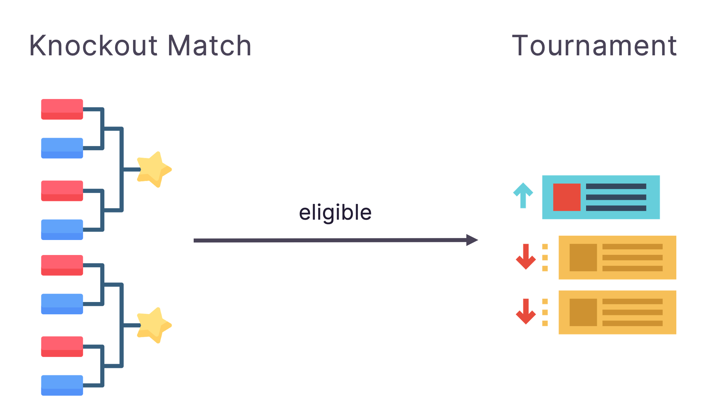

# Competition Format

!!! warning "We are adjusting the competition format"

    We are experimenting with different modes based on user feedback.
    We would love to hear your thoughts!

## Challenge

In challenge mode, the experience is similar to a CTF (Capture The Flag) contest. Participants compete against our sample bot, which is equipped with specific techniques. Your goal is to bypass these techniques. You can attempt the challenge multiple times to learn and improve your approach for a particular technique. Unlike the more open-ended development in Tournament and Knockout Match modes, challenge mode focuses on overcoming specific target.

## Tournament

In the tournament stage, participants will be paired with opponents with similar score for the competition. The results of each match will be updated based on the ELO point system. The competition will continue until the end of the event, with medals awarded to the top three participants with the highest score.

Participants advancing to the tournament from the knockout match do not need to sign up actively. The version of the malware or EDR used will be the latest version used by the participant at the start of the tournament.

## Knockout Match

The knockout match is held every hour, where participants are paired based on their roles (Malware or EDR). The side that meets the victory conditions in the competition will be retained. If the number of Malware and EDR participants is unequal, there may be one-to-many situations. For example, when the number of Malware is less than EDR, one Malware participant will face multiple EDR participants. In this case, as long as the Malware participant wins in one of the matches, they can advance to the next round. When only one participant remains on one side, all remaining participants will advance to the second stage of the tournament and be awarded prizes.

Participants must actively sign up for the knockout match. The version of the malware or EDR used will be the latest version uploaded by the participant by the time that knockout match start. Newly uploaded malware and EDR can only be used in subsequent knockout matches.

