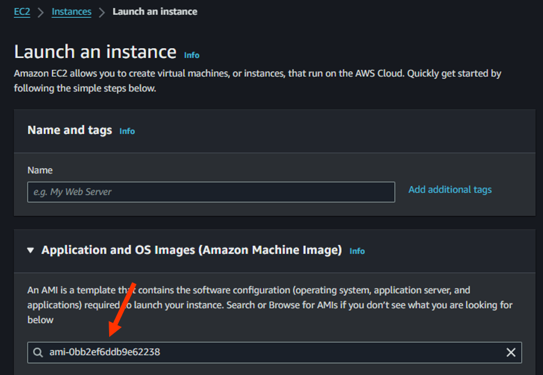
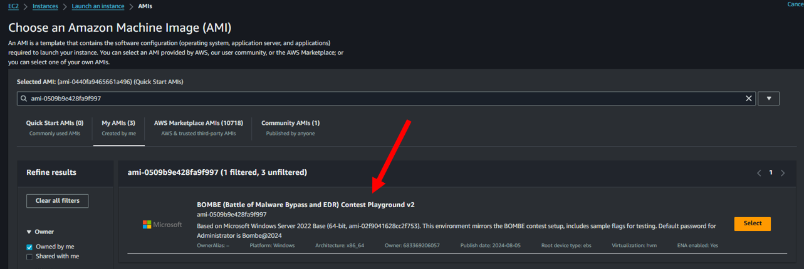

# Get Started

You can start from our sample code https://github.com/bombe-match/bombe-poc.  
Our sample code is written in `C#` with `.NET Runtime 6.0`.  

!!! warning "Don't forget the replace secret"

    Remember to replace the `secret` with your own `secret`!  
    The `secret` used in the sample and test environment is `00000000000000000000000000000000`.

```sh
git clone https://github.com/bombe-match/bombe-poc
```

## Test Environment

We have publish a playground AMI `ami-0509b9e428fa9f997` (us-west-2) for you to test your sample. In AWS console, you can launch an new EC2 and search for our AMI `ami-0509b9e428fa9f997`.

!!! warning "Remember to switch region"

    You need to switch your region to `us-west-2` in order to use our AMI.



Choose our AMI in Communtiy AMI.



!!! info "Login via RDP"

    To use RDP with your EC2 instance, first expose the EC2 instance to the internet. 
    Then, connect to the EC2 instance using its public IP via RDP. 
    The default Administrator password is `Bombe@2024`. Be sure to change this password after logging in.

Inside the environment, we have already placed all 3 flags inside:

1. Registry: `answer_1` in `HKLM:\SOFTWARE\BOMBE`
    - flag is `BOMBE_MAL_FLAG_11111111111111111111111111111111`
2. Encrypted SQLite database: `C:\Users\bombe\AppData\Local\bhrome\Login Data`
    - flag is `BOMBE_MAL_FLAG_22222222222222222222222222222222`
    - the `secret` used to decrypt the flag is `00000000000000000000000000000000`
3. Memory of the specified process: `bsass.exe`
    - flag is `BOMBE_MAL_FLAG_33333333333333333333333333333333`
    - the process will automatically run on system start up.

Refers to our [Rules](../Rules) for more information.
